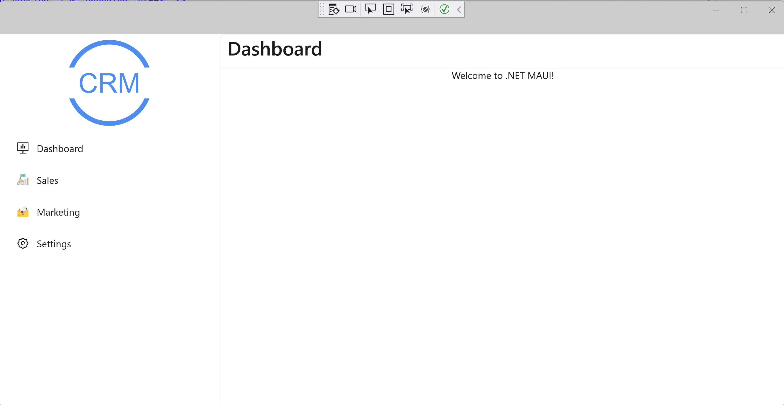

# Cosmos sample
## Azure function with cosmos
1. 在项目CosmosSample_AzFunctions配置文件appsettings.json中替换你的cosmos配置
2. 在项目CosmosSample_AzFunctions中文件增加你的local.settings.json文件本地开发配置
``` bash
{
  "IsEncrypted": false,
  "Values": {
    "AzureWebJobsStorage": "UseDevelopmentStorage=true",
    "FUNCTIONS_WORKER_RUNTIME": "dotnet"
  },
  "Host": {
    "LocalHttpPort": 7071,
    "CORS": "*"
  }
}
```
3. 进入CosmosSample.AzFunctions目录运行 func start（确保已经安装工具 [Azure Functions Core Tools](https://docs.microsoft.com/en-us/azure/azure-functions/functions-run-local?tabs=v4%2Cwindows%2Ccsharp%2Cportal%2Cbash%2Ckeda) ）
4. 运行后可以看到MemberRegiste Login SaveDailyQuote GetDailyQuote 的api路径 
5. 调试接口时如果是第一次链接到 cosmos db 运行注释掉的await _cosmosdbContext.Database.EnsureCreatedAsync();
6. 发布azfunction至远程先az login然后 func azure functionapp publish <YOUAzureFucntion_APP_NAME> 

## Maui CRM app with Azure Function
1. 打开项目就可以看到CosmosSample.MauiCRM
2. 确保已经安装workload maui
3. 选择windows或则Android emulator运行maui程序就可以看到如下效果


<center>图crm-windows</center>


<center>图crm-android</center>
4. 选择ios远程设备，确保设备vs2022已经和mac设备配对(配对时mac安装mono和xcode)


<center>图crm-mac-pair</center>

## Vue app with Azure Function
1. 进入目录 CosmosSample.VueApp 运行 npm install 
2. 更改文件.env.development的api地址为az function的地址 npm run dev
3. 登录你在az function注册的member 获取你在az function上添加的日线行情

## Maui app with Azure Function
1. 进入目录 CosmosSample.MauiAzApp
2. 用vs 2022打开.sln文件，更改文件MauiProgram url地址为你的azure function地址
3. 以Android emulator运行程序 （确保安装workload maui）